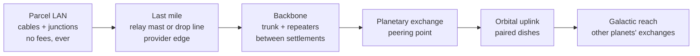

# Network Engineer & Player Networks

> Preserved on 2026-07-28. This is design source, not current runtime
> documentation. Recheck every code path, hash, and implementation-status claim
> against the current source tree before using it. Current truth lives in
> `docs/CANONICAL_CONTEXT.md`, `docs/CURRENT_PROJECT_STATE.md`, and
> `docs/VERIFICATION.md`.

**Author:** NetworkEngineerDoc (creative-wave research lead)  ·  **Date:** 2026-07-19  ·  **Status:** decision-ready design, no code yet
**Sibling docs:** `docs/future/bioengineer-and-crop-engineering.md` (profession-shape precedent), `docs/future/grid-structure-framework.md` (placement primitive every device here rides on)
**Owner directive:** a Network Engineer profession with real infrastructure and real economics, plus a bounded creative-logic layer with 2003-sandbox energy — the thing Wiremod gave Garry's Mod — without ever letting a player script run wild on the authority server.

This doc separates **observed runtime truth** (cited to files at the studied source revision) from **proposal** (everything in §1 onward). No proposed type, command, or item id in this document exists in the codebase. Numeric item ids are deliberately not assigned here; the taken bands are listed in §12.6 and allocation happens at implementation time against the live `authority.rs` constants.

Primary external source: the live Wiremod repository, `wiremod/wire`, pinned at commit `67cbe4a96caf7ab2aaf00df0b525710a2e80155e` (master as of 2026-07-19T01:47:46Z). All Wiremod citations below are blob URLs pinned to that commit, not mutable master.

---

## §W — WIREMOD: STATUS, HISTORY, AND WHAT THE CODE ACTUALLY SAYS

### W.1 Status and history

- **Repo:** https://github.com/wiremod/wire — Apache-2.0, not archived, actively maintained. Observed master commit `67cbe4a96caf7ab2aaf00df0b525710a2e80155e`, committed 2026-07-19T01:47:46Z (today). Nineteen years after the original 2007-era Garry's Mod addon, people are still merging PRs into it. The standalone wire-cpu (ZCPU) project was merged back into the main repo in early 2026.
- **Distribution:** Steam Workshop item https://steamcommunity.com/sharedfiles/filedetails/?id=160250458.
- **What it is:** a Garry's Mod addon that turns sandbox props into a component electronics kit. Every wire entity derives from `base_wire_entity` and exposes named, typed input/output ports (`WireLib.CreateInputs` / `WireLib.CreateOutputs`); players draw wires between ports with a tool. On top of that sits **Expression 2 (E2)**, a full scripting language with a tokenizer, parser, and compiler written in Lua, executing on the server inside a quota harness.

### W.2 Code archaeology — the parts that matter for us

Everything below was read from the pinned tree, not from wiki memory.

**The language pipeline is real compiler machinery.** The E2 tokenizer is a rewritten class-based lexer with hex/binary/complex/quaternion literals and error-skipping ([base/tokenizer.lua](https://github.com/wiremod/wire/blob/67cbe4a96caf7ab2aaf00df0b525710a2e80155e/lua/entities/gmod_wire_expression2/base/tokenizer.lua)); parser and compiler live beside it under `lua/entities/gmod_wire_expression2/base/`. A chip compiles to Lua closures that the entity `pcall`s.

**Execution is metered at three layers, and the meters are the design.** In [lua/entities/gmod_wire_expression2/init.lua](https://github.com/wiremod/wire/blob/67cbe4a96caf7ab2aaf00df0b525710a2e80155e/lua/entities/gmod_wire_expression2/init.lua):

- `updateQuotas()` reads six convars into `e2_softquota` / `e2_hardquota` / `e2_tickquota` / `e2_timequota` / `e2_globalmax`. Every E2 function has an ops cost (`__e2setcost`); a chip that exceeds the tick quota mid-run throws `"perf"` and errors out with *"tick quota exceeded (at line N, char M)"*.
- `ENT:Execute` increments `context.stackdepth` and errors at `>= 150` (*"stack quota exceeded"*), benches wall time around the `pcall`, and after every run checks `prfcount + prf - e2_softquota > e2_hardquota` — the accumulated-debt hard kill.
- `ENT:UpdatePerf` keeps `prfbench`/`timebench` as exponential moving averages, which feed the per-player (`e2_timequota`) and server-global (`e2_globalmax`) sheds: when the whole server is over budget, the laggiest chips get disabled first. Soft quota, hard quota, per-player average, global shed — four layers, each catching what the previous one misses.

**Cross-entity access is ownership-gated at every call site.** The wirelink core ([core/wirelink.lua](https://github.com/wiremod/wire/blob/67cbe4a96caf7ab2aaf00df0b525710a2e80155e/lua/entities/gmod_wire_expression2/core/wirelink.lua)) lets a chip drive another entity's ports and read/write its memory cells — and `validWirelink` demands `IsValid(ent)` **and** `isOwner(self, ent)` before anything moves. Output triggers are cached per run in `self.triggercache` and flushed once on `postexecute`, not mid-execution. The same file implements strings-as-memory: `WriteStringZero`/`ReadStringZero` serialize text into numbered cells, with `ReadStringZero` refusing to scan past 16,384 cells. Even raw memory access has a leash.

**Dangerous extensions ship off by default and say why.** Prop Core registers with `E2Lib.RegisterExtension("propcore", false, ...)` and its own warning string: *"Can be used to teleport props to arbitrary locations, including other player's faces"* ([core/custom/prop.lua](https://github.com/wiremod/wire/blob/67cbe4a96caf7ab2aaf00df0b525710a2e80155e/lua/entities/gmod_wire_expression2/core/custom/prop.lua)). Inside it: `sbox_E2_maxPropsPerSecond` defaults to 4 spawns/second/player, `WithinPropcoreLimits` enforces it on a rolling 1-second window, `ValidAction` rejects non-owned entities and stamps `entity.e2_propcore_last_action[cmd]` so the same action on the same entity is once-per-tick. The HTTP core is blunter: registered disabled with the description *"Allows any E2 to make your server make arbitrary HTTP GET requests to any site. It can use this to make HTTP requests to any IP address inside your local network."* — a 3-second per-player cooldown and 15-second timeout when an admin does enable it ([core/http.lua](https://github.com/wiremod/wire/blob/67cbe4a96caf7ab2aaf00df0b525710a2e80155e/lua/entities/gmod_wire_expression2/core/http.lua)).

**File I/O is quota'd and path-jailed.** [core/files.lua](https://github.com/wiremod/wire/blob/67cbe4a96caf7ab2aaf00df0b525710a2e80155e/lua/entities/gmod_wire_expression2/core/files.lua): `wire_expression2_file_max_size` caps transfers at 1024 KiB, `wire_expression2_file_max_queue` allows 5 queued transfers per player, every path goes through `E2Lib.isValidFileWritePath`, and `fileLoad` costs 100 ops while a status poll costs 3.

**Chip-to-chip messaging has a three-level trust scope.** The datasignal core ([core/datasignal.lua](https://github.com/wiremod/wire/blob/67cbe4a96caf7ab2aaf00df0b525710a2e80155e/lua/entities/gmod_wire_expression2/core/datasignal.lua)) queues sends and delivers them only if `IsAllowed` passes: scope 0 = own chips only, scope 1 = prop-protection friends, scope 2 = everyone, checked on **both** the sender's and receiver's declared scope. Consent is bilateral.

**Chips can rewire the world — with cost and ownership.** [core/custom/wiring.lua](https://github.com/wiremod/wire/blob/67cbe4a96caf7ab2aaf00df0b525710a2e80155e/lua/entities/gmod_wire_expression2/core/custom/wiring.lua): `createWire` costs 30 ops, requires the caller to own **both** endpoints, verifies the named ports exist, and suppresses the retrigger that the new link would otherwise cause mid-run.

**Physical wireless devices, not magic packets.** The Wire Radio ([lua/entities/gmod_wire_radio.lua](https://github.com/wiremod/wire/blob/67cbe4a96caf7ab2aaf00df0b525710a2e80155e/lua/entities/gmod_wire_radio.lua)) is a placeable box: channels are string keys into a global registry, each channel holds a 32-value data array, `send` writes one subchannel and notifies every subscriber except the sender, and `Secure_Channels` namespaces a private channel space per SteamID. The Data Satellite Dish ([lua/entities/gmod_wire_data_satellitedish.lua](https://github.com/wiremod/wire/blob/67cbe4a96caf7ab2aaf00df0b525710a2e80155e/lua/entities/gmod_wire_data_satellitedish.lua)) accepts a link **only** from a `gmod_wire_data_transferer` and rebinds that pairing through dupe save/restore by entity index. Long-range comms is two physical objects that must be individually placed and explicitly paired.

**Storage can be dumb and still useful.** The Data Store ([lua/entities/gmod_wire_data_store.lua](https://github.com/wiremod/wire/blob/67cbe4a96caf7ab2aaf00df0b525710a2e80155e/lua/entities/gmod_wire_data_store.lua)) is seventeen lines: eight named values, A through H, persisted through duplication. People build whole systems out of these.

**Visual output is capped like everything else.** Holograms ([core/hologram.lua](https://github.com/wiremod/wire/blob/67cbe4a96caf7ab2aaf00df0b525710a2e80155e/lua/entities/gmod_wire_expression2/core/hologram.lua)): `wire_holograms_max` 250 per player, 15 spawns/second, an 80-spawn burst pool refilling every 10 seconds, max scale 50, and a model whitelist unless the server opts out. EGP screens and the gate/sensor/CPU/GPU entity families are confirmed present in the pinned tree (`lua/entities/gmod_wire_egp/`, `gmod_wire_cpu.lua`, `gmod_wire_gpu/`) — same pattern, per-surface object caps and replication throttles.

### W.3 The one-sentence lesson

Wiremod survived two decades of griefers by making every capability **physical, owned, metered, and off-by-default when dangerous** — and it stayed beloved because inside those walls the expressive ceiling is enormous. That is the design we are stealing. The thing we are *not* stealing is the delivery vehicle: a general-purpose language interpreted on the server, which even Wiremod only gets away with because a GMod server holds 20 friends, not an MMO shard.

---

## §M — STEAL / TRANSLATE / REJECT

| Wiremod mechanic | Evidence | Verdict | Successor form |
|---|---|---|---|
| Typed named ports on physical devices | `WireLib.CreateInputs/Outputs`, radio `Setup` | **Steal** | Every network device is a placed structure with typed ports (§6.2) |
| Wires as explicit player-drawn links | wiring.lua owner checks | **Steal** | `LinkPorts` command; both endpoints owner- or grant-gated |
| Event-driven execution (inputs trigger, no idle spin) | `ENT:TriggerInput`, `ExecuteEvent` | **Steal** | Programs run only on events; zero per-device tick loops (§6.4) |
| Layered quota stack (ops / hard debt / per-player avg / global shed) | init.lua quotas | **Steal the shape** | §10 quota ladder, closed-form where possible |
| Stack-depth cap, per-entity action-per-tick throttle | init.lua `stackdepth >= 150`, prop.lua `e2_propcore_last_action` | **Steal** | Event-chain depth cap; per-device command dedup per tick |
| Danger features off-by-default with honest warnings | propcore/http `RegisterExtension(..., false, warning)` | **Steal the attitude** | Capability grants are explicit, physical, and revocable (§11) |
| wirelink (drive another entity's ports/memory) | wirelink.lua `validWirelink` | **Translate** | Capability handle: a bound, owner-issued grant object, not an entity reference (§6.3) |
| Radio channels + secure per-player channel space | gmod_wire_radio.lua | **Translate** | Spectrum devices: shared local bands + keyed private channels, range-limited by hardware tier (§6.7) |
| Satellite dish / transferer explicit pairing | gmod_wire_data_satellitedish.lua `LinkEnt` class check | **Translate** | Long-haul links are two paired placed devices; pairing is part of install (§3) |
| Data store (tiny named-register storage) | gmod_wire_data_store.lua | **Translate** | Register bank device; bounded key/value store device at higher tier (§6.6) |
| Holograms / EGP displays with hard caps | hologram.lua convars | **Translate** | Display devices: glyph/vector surfaces with per-surface element caps and replication budgets (§6.5) |
| Duplicator save/restore with pairing rebind | satellitedish `BuildDupeInfo` | **Translate** | Blueprints; **all capability grants strip on copy and rebind on install** (§9) |
| Datasignal bilateral trust scopes | datasignal.lua `IsAllowed` | **Translate** | Message grants require sender capability AND receiver acceptance policy |
| Expression 2, a general server-side language | base/tokenizer.lua etc. | **Reject** | Finite node programs on a deterministic event VM — §7 explains why |
| Prop spawning / world manipulation from code | prop.lua | **Reject** | Devices act only through their own ports and issued capabilities; nothing spawns or moves world objects |
| HTTP to the real internet | http.lua | **Reject** | Nothing in the game touches the real network, in any configuration |
| Real filesystem I/O | files.lua | **Reject** | Storage devices are authority state, not files |
| Per-chip wall-clock benching (`SysTime`) | init.lua `UpdatePerf` | **Reject the mechanism** | Wall time is nondeterministic; our budgets count deterministic fuel units (§10) |

The rejects are not caution for its own sake. Successor's authority is a deterministic, replay-locked Rust sim whose exports hash byte-stable (`AuthorityStateExportV1`, `crates/successor-sim/src/authority/snapshots.rs:155`). Wall-clock benching, real I/O, and unbounded interpretation each break replay before they break safety.

---

## §1 — THE PROFESSION: NETWORK ENGINEER

### 1.1 Identity

The Network Engineer is the settlement's lineman and systems tech in one body. She smelts copper into cable spools, climbs the relay mast she bolted together last week, crimps a subscriber drop at a farmer's parcel, flashes a controller program onto an irrigation valve, and bills eleven households for the uplink she runs off a ridge tower. When the storm knocks the ridge repeater sideways, everyone in the valley knows exactly whose door to knock on.

The fantasy is competence, not wizardry. Wiremod's crowd stayed for twenty years because building a working thing out of dumb parts feels good; the profession wraps that feeling in an economy where the working thing is also somebody's phone line.

### 1.2 Tree shape (canonical novice + 4 tracks + master, 97 SP)

Same curve as every landed profession: novice 16 SP, four tracks at 8/6/4/2 per rank, master 1 SP, XP gates 0/100/300/650/1100/1800 — total 97 SP against the 250-point cap (`docs/CANONICAL_CONTEXT.md`; box math per `authority_skill_box_definition`, `crates/successor-sim/src/authority/model.rs:2051`, tracks per `authority_skill_box_tracks`, `model.rs:2150`). Adding the profession means one new variant on `AuthorityProfessionKind` (`model.rs:998`), one tracks row, and a `progression.v1.json` block matching the existing node shape — the exact integration path bioengineer-design.md §1.3 already walked.

| Node | Track | What it unlocks |
|---|---|---|
| `netengineer-novice` | novice | Crimp tool + line tester + starter cable; place tier-1 devices; read port panels. Title **Novice Network Engineer**. |
| `netengineer-fabrication-i..iv` | fabrication | Manufacture cable, radios, relays, controllers; higher-stat hardware from better resource lines; backbone- and orbital-class hardware at iii/iv. |
| `netengineer-fieldwork-i..iv` | fieldwork | Longer/faster line runs; splice and bury cable; diagnose faults through walls of other people's bad wiring; repair speed and storm-hardening; service-call tooling on foreign parcels (with owner grant). |
| `netengineer-systems-i..iv` | systems | Program size/fuel ceilings; more ports per controller; displays, sensors, storage tiers; capability-grant authoring. |
| `netengineer-carrier-i..iv` | carrier | Relay/tower placement rights; provider registration (ii); plans, peering, and roaming contracts (iii); orbital uplink operation (iv). |
| `netengineer-master` | master | Title; +1 concurrent provider region; the exclusive top-tier uplink craft; master fault-diagnosis (read a whole route's health at a glance). |

XP sources are actions, per canon: fabrication XP from hardware crafts, fieldwork XP from installs/splices/repairs (repairs on *other people's* infrastructure pay the most — the profession is social on purpose), systems XP from programs deployed and events they successfully handle (capped per program per day so a blinker farm earns nothing), carrier XP from subscriber-weeks actually billed and peering traffic actually carried.

### 1.3 Why the profession is economically necessary — without a hard lock

Three demand pumps, none of which gates a basic need:

1. **Connectivity is a paid service** (§4). Beyond the free starter grid, planetary and orbital reach costs a weekly fee. The NPC fallback exists everywhere but is priced like a satellite phone: it works, it hurts, and every hamlet that hates the price is a customer list for the first player who trenches real cable to them.
2. **Automation hardware wears and breaks.** Devices are manufactured from real resource lines (copper `2_007`, polymer `2_010`, carbon `2_008` — `crates/successor-sim/src/authority.rs:440-444`), and storms degrade exposed infrastructure the way weather already interacts with camps and shelter (`CAMP_SHELTER_HALF_EXTENT_MILLI_CELLS`, `authority/camps.rs:33`). Repair is a service call.
3. **Every other profession wants what the machines do.** Farmers want moisture-triggered valves, guilds want door policy and intruder bells, traders want stock boards, medics want triage displays. The Network Engineer sells the nervous system that everyone else's stuff plugs into.

And the anti-lock guarantees, stated once here and enforced in §5: nothing on the local-and-safety row of the entitlement matrix ever requires a subscription, and the NPC ceiling means no player provider can price captives — only underprice the robot.

---

## §2 — MANUFACTURED HARDWARE

All hardware is crafted through the landed session machine — recipes, slots, weighted stat lines, assembly, experimentation (`CRAFT_RECIPES`, `crates/successor-sim/src/authority/crafting.rs:1103`; `craft_line_cap_milli_from_stats`, `crafting.rs:2800`; `apply_craft_experiment`, `crafting.rs:1898`). Resource stats flow into device stats exactly the way they flow into a slugthrower today: better copper makes a lower-loss cable, and the cap math is the existing cap math. No new crafting subsystem.

Placement of every device below is a row in the grid-structure framework (`docs/future/grid-structure-framework.md` §B/§C: `StructureAnchor` + per-class payload) — a class row, not a new placement system.

| Tier | Device | Inputs (resource families) | Role | Stat lines that matter |
|---|---|---|---|---|
| 1 | Cable spool (copper) | copper, polymer | Short parcel runs | loss/meter, weather rating |
| 1 | Junction box | mineral, polymer | Split/patch point; the port panel | port count |
| 1 | Register bank | copper, mineral | 8 named values, Wiremod data-store homage | capacity |
| 1 | Panel display | polymer, chemical | Small glyph/number surface | element cap |
| 1 | Contact sensor / switch / button | mineral | Inputs for everything | debounce quality |
| 2 | Local radio | copper, chemical | Shared-band wireless in a small radius | range, channel count |
| 2 | Controller | copper, carbon, polymer | Runs one node program (§6.4) | fuel/event, memory, ports |
| 2 | Environment sensors | chemical, gas | Moisture, weather, daylight, proximity | precision, poll rate |
| 2 | Actuator couplers | mineral, polymer | Drive a door, valve, lamp, feeder on the same parcel | reliability |
| 3 | Relay mast | carbon, mineral, copper | Last-mile wireless coverage; the subscriber edge | radius, capacity, storm rating |
| 3 | Trunk cable + repeater | copper (high grade), carbon | Buried long runs between settlements | loss, capacity |
| 3 | Keyed radio | copper, chemical | Private channels (radio `Secure_Channels` homage) | key slots, range |
| 3 | Vault store | mineral, carbon | Bounded key/value storage device | capacity, read grants |
| 4 | Backbone exchange | carbon, copper, fuel | Region-scale switching; where peering physically lands | route capacity |
| 4 | Orbital uplink dish | carbon, gas, fuel | Planet ↔ orbit hop; paired like the Wiremod dish/transferer | lock quality, weather margin |
| 4 | Provider office terminal | (structure) | Register a provider, publish plans, read billing | — |

Progression is legible from the table: tier 1 is a novice on starter resources, tier 3 is where fieldwork and real resource logistics start paying, tier 4 is master-adjacent capital equipment that a guild funds. Item ids come from a fresh band allocated at implementation against the live constants in `authority.rs` (§12.6); this doc deliberately assigns none.

---

## §3 — TOPOLOGY: FROM A DOORBELL TO THE GALAXY

Five layers. Every one is a physical thing somebody placed, and every one can fail.

- **Parcel LAN.** Cable between devices on ground you control (your parcel — `ParcelAuthorityState`, `crates/successor-sim/src/authority/farm_model.rs:296` — or a structure whose owner granted you install rights). Works with zero subscriptions forever. This is where all the §13 contraptions live.
- **Last mile.** A relay mast covers a radius; parcels inside it can subscribe to whatever provider owns the mast. Drop lines are the wired equivalent for adjacent parcels. Coverage is literal geometry, same discipline as camp shelter boxes and terminal interaction radii (`docs/CANONICAL_CONTEXT.md`, Dustgate terminals validated within 1,750 milli-cells).
- **Backbone.** Trunk cable with repeaters, or long-shot directional radio, linking masts and settlements into one provider network. Trenching a backbone is slow, expensive fieldwork — which is exactly why owning one means something.
- **Planetary exchange.** The building where providers interconnect. Peering agreements (§4.4) are contracts between exchanges that share a site or a trunk.
- **Orbital and galactic.** An uplink dish pairs with an orbital relay; that pairing is explicit, two-ended, and persistent, the satellite-dish/transferer model. A planet with at least one live uplink has galactic reach; traffic to another planet rides your provider → exchange → uplink → their uplink → their provider. Travel already crosses planets by ticket (`PurchaseTravelTicket`, `crates/successor-sim/src/command_manifest.rs:1415`); the network is the *information* layer over the same map, and unlocking it is what lights up the planetary/orbital map layers and remote services in §5.

Topology is authority state recomputed on edit, never per tick: placing, linking, or destroying a device marks the region's graph dirty; the next command or projection that needs reachability recomputes and caches routes (§12.3). A quiet network costs the sim nothing.

---

## §4 — PLAYER PROVIDERS

### 4.1 Formation

A carrier-ii Network Engineer (or a guild fronting one) registers a **provider** at a provider office: name, home region, deposit. The deposit is a credits sink and a seriousness filter, sized well below the 250,000-credit guild charter precedent (`docs/CANONICAL_CONTEXT.md`). A provider owns masts, trunks, exchanges, uplinks; publishes plans; and accrues billing.

### 4.2 Plans and billing

Plans are simple published rows: coverage (which masts), reach (local / planetary / galactic), a weekly price, and a fair-use message budget. A household subscribes at a terminal or through any covered relay.

Billing copies the landed parcel-upkeep shape verbatim: prepaid period, `paid_through_tick`, lapse **pauses service and never confiscates** (`apply_pay_upkeep`, `crates/successor-sim/src/authority/land.rs:180-217`). A lapsed subscriber drops to the free entitlement rows; re-pay and service resumes. No debt, no repo man.

Weekly cadence, in game days, converted through the same ticks-per-game-day plumbing upkeep already uses (`land.rs:196-197`).

### 4.3 The NPC fallback and the starter guarantee

- **Municipal starter grid.** The Dustgate start zone (`docs/CANONICAL_CONTEXT.md`, fixture `planetfall-v5-seed-424242-…`) carries free planetary-tier service within the municipal footprint. New players never experience the network as a paywall; they experience it as a thing the town has and the frontier doesn't.
- **NPC satellite service.** Everywhere else, an NPC carrier sells planetary and galactic reach at a deliberately painful flat rate — the balance knob is pinned in §15, and its floor is "several times any sane player price." It never undercuts players, never expands coverage, and never runs promotions. It is the ceiling under which every player market forms.

### 4.4 Peering, transit, roaming

- **Peering:** two providers with exchanges on a shared site or trunk agree to exchange traffic, free or settled. A peered pair's subscribers reach each other's coverage for intra-planet services.
- **Transit:** a small provider buys reach through a big one's backbone — the big one carries their traffic upstream for a weekly wholesale fee. This is how a two-mast village outfit sells "galactic" without owning a dish.
- **Roaming:** a subscriber inside a foreign provider's coverage gets service if the providers have a roaming contract (per-week surcharge, split between them). No contract, no roam — carry a keyed radio like everyone else.

All three are authority contracts with the trade/exchange machinery as precedent (trade command handling, `crates/successor-sim/src/authority/commands.rs`; economy settlement, `authority/economy.rs`).

### 4.5 Competition, failure, and why there is no passive throne

- **Infrastructure decays.** Masts, repeaters, and dishes take weather wear (storm-resistance is a crafted stat, and weather is already a sim input per the camp/shelter system). An unmaintained network degrades to dead in weeks. Rent requires labor; there is no set-and-forget monopoly.
- **Coverage is contestable.** Nothing stops a rival mast beside yours. Subscribers switch by re-subscribing; there are no termination fees and no exclusive territory.
- **The NPC ceiling caps abuse.** Price above the robot and you have zero customers by construction.
- **Provider failure is graceful.** If a provider's hardware dies or the owner quits, subscriptions lapse to paused (never charged for dead air — a service-health check gates each billing period), subscribers fall to the free rows, and the physical assets follow ordinary ownership/decay rules: salvageable, purchasable, or eventually derelict and reclaimable. A dead ISP is a business opportunity lying on the ground.
- **Safety is out of scope for markets, period** (§5). The worst a hostile provider can do is make *remote convenience* expensive — and only until a competitor smells the margin.

---

## §5 — SERVICE ENTITLEMENT MATRIX

The single most load-bearing table in this doc. Rows are services; columns are a character's connectivity state. **The first group is free everywhere, always, and no provider, price, outage, or griefer can touch it.**

Connectivity states: **Offline** (outside all coverage, no subscription), **Local** (own parcel LAN and/or municipal grid), **Planetary** (active planetary plan or standing inside owned coverage), **Galactic** (planetary + a live uplink path).

| Service | Offline | Local | Planetary | Galactic |
|---|---|---|---|---|
| **Guaranteed tier — never paywalled** | | | | |
| Local/zone/party chat, whisper (per `docs/CHAT_SYSTEM.md` channels) | ✔ | ✔ | ✔ | ✔ |
| Emergency ping (position beacon to zone) | ✔ | ✔ | ✔ | ✔ |
| Bank/trade/clone at their physical terminals | ✔ | ✔ | ✔ | ✔ |
| Parcel LAN: all owned devices, programs, displays | ✔ | ✔ | ✔ | ✔ |
| Shared-band local radio (device-range-limited) | ✔ | ✔ | ✔ | ✔ |
| **Planetary tier** | | | | |
| Planet map layer with live points of interest | — | town only | ✔ | ✔ |
| Remote telemetry from own devices elsewhere on planet | — | — | ✔ | ✔ |
| Remote market browse/list (planet exchanges) | — | town only | ✔ | ✔ |
| Guild operations at distance (per landed guild scope) | — | town only | ✔ | ✔ |
| In-game mail within planet | — | town only | ✔ | ✔ |
| **Galactic tier** | | | | |
| Orbital + galactic map layers | — | — | — | ✔ |
| Global/off-planet channels | — | — | — | ✔ |
| Cross-planet telemetry, mail, market browse | — | — | — | ✔ |
| Cross-planet program messaging (§6.7, budgeted) | — | — | — | ✔ |

Design intent in one line: subscriptions buy **reach**, never **function**. A hermit with no coin and no neighbors runs a fully automated homestead off the guaranteed tier and loses only the ability to check on it from town.

---

## §6 — THE MACHINE MODEL (bounded typed nodes, wires, programs)

### 6.1 Doctrine

Devices are placed structures. Ports are typed. Wires are explicit links. Programs are finite data interpreted by a deterministic event VM inside a fuel budget. Nothing runs when nothing happens. Every cross-owner touch goes through a capability handle. All of it is ordinary authority state that joins `write_stable_hash` and the versioned export like everything else (`snapshots.rs:155`).

### 6.2 Nodes and ports

Each device class declares fixed, named, typed ports — the `WireLib.CreateInputs/Outputs` idea with a closed type set:

- `pulse` — momentary trigger
- `level` — milli scalar `0..1000` (house convention, same as `ResourceStats`)
- `count` — u32
- `text` — bounded short string (display/label lane only)
- `id` — an opaque reference the VM can compare but never forge

Links are `LinkPorts(source_device, out_port, target_device, in_port)`; types must match; both endpoints must be owned by the caller or covered by an install grant. Link count per device is a hardware stat.

### 6.3 Capability handles

The wirelink translation, and the security cornerstone. A **capability handle** is an owner-minted grant: *device X may invoke action Y on target Z*, e.g. "this controller may toggle this door," "this sensor may read this parcel's weather," "this program may post to keyed channel K." Properties:

- **Physical to create** — minted at the target by its owner, standing in interaction range, like every gated interaction today (terminal-radius precedent).
- **Explicit and enumerable** — a parcel owner sees every handle outstanding against their stuff and revokes any of them cold.
- **Non-transferable by copy** — blueprints strip handles (§9). A duplicated door program controls no door until the new owner walks to a door and binds one.
- **Scoped, never ambient** — there is no "run as owner." A program holds exactly the handles bound to it, nothing else. Wiremod's `isOwner`-at-every-callsite, turned from a check into an object.

### 6.4 Programs and the event VM

A controller holds one **program**: a bounded rule graph — small instruction set over the port types (compare, arithmetic on levels/counts, latch, timer-schedule, select, emit) — authored in a client-side visual editor and submitted as data. The authority **validates** it at install: size cap, port references resolve, capability references resolve, static event-chain depth within bounds. Invalid programs are rejected at the door with reason codes, the same shape as every command rejection today (`AuthorityRejectReason` family).

Execution is event-only:

- **Triggers:** a wired input edge, a subscribed sensor crossing a threshold, a scheduled timer (min interval floored — the anti-spin knob), a received message, a player Use.
- **Run:** the VM interprets the rule graph with a **fuel meter** — every op costs fuel, the budget is a hardware stat, overrun halts the program in a visible faulted state (E2's *"tick quota exceeded"*, made polite: faults show on the device's panel, fixing them is gameplay).
- **Effects:** write output ports, emit messages, invoke held capabilities. Output writes cascade at most `depth` hops through wired links (the `stackdepth >= 150` cap, scaled way down; see §15) and cascade fuel is charged to the originating owner.
- **Timers are lazy.** A scheduled wake is a priority-queue entry, evaluated closed-form when due — the extractor hopper discipline (`ExtractorState` lazy accrual precedent, `model.rs`), not a per-device Think loop.

Determinism: no wall clock, no RNG, fuel counts are integer ops, message ordering is deterministic (tick, then stable device id). Native == wasm32, replay-locked, like all authority math.

### 6.5 Displays

Panel (tier 1) and board (tier 3) displays render bounded element sets — glyphs, numbers, bars, vector strokes — with a per-surface element cap and a replication budget per second, the EGP/hologram lesson applied to AOI delta traffic. Display content rides the snapshot like extractor hopper detail does today: coarse state to everyone in interest radius (`area_interest_radius_cells` default 64, `authority.rs:727,804`), full fidelity to closer viewers.

### 6.6 Sensors, control, storage

- **Sensors** publish `level`/`pulse` from things the sim already knows: weather at a cell, daylight/season (pure functions of tick), proximity crossings, container fill, crop moisture (Agriculture's cached profile lane), power state. Poll rate is a hardware stat; between polls the value is the cached last sample. Sensors never see anything a player at that spot couldn't.
- **Control** couplers drive same-parcel actuators: doors, lamps, valves, feeders, gates. Each coupler action is a normal authority mutation, permission-checked through the capability handle on every invocation — revocation is instant.
- **Storage:** the register bank (eight named values, a knowing homage to the seventeen-line data store) and the vault store (bounded key/value with read-grant capabilities). Storage joins the export/hash; it is state, not files.

### 6.7 Radios and messaging

- **Shared local band:** any local radio can talk on numbered public channels within device range. Free tier, deliberately gossipy — the whole neighborhood hears channel 3, which is half the fun.
- **Keyed channels:** keyed radios mint channel keys; holders of a key device can send/listen. The `Secure_Channels` translation, with the key as a physical, tradeable, losable item.
- **Network messages:** program-to-program messages across provider coverage consume the subscriber's fair-use message budget and require reach per §5. Sender needs a messaging capability; receiver policy (own/keyed/anyone) gates delivery — datasignal's bilateral consent, kept.

---

## §7 — WHY THIS IS NOT E2 ON THE SERVER, AND WHY FREEDOM SURVIVES THE BOUNDS

**Not E2, structurally.** E2 is a language: unbounded loops, dynamic dispatch, a compiler in the loop, cost discovered at runtime by counting until the meter trips. Our programs are finite rule graphs whose worst case is computable **at install**: max fuel per event × max event rate × max cascade depth is a static product. Wiremod meters execution and kills offenders after the fact; we admission-check and then meter as a backstop. There is no interpreter running player-authored control flow of unknown shape inside the tick, no wall-clock benching (nondeterministic, banned by replay), no `pcall`-and-pray. A hostile program's ceiling is a number we chose, not a number we hope for.

**Also not E2 in blast radius.** E2's dangerous cores reach outward — spawn props, fetch URLs, write files. Our effect surface is closed: ports, messages, and enumerable capability handles. The maximum a compromised program does is everything its handles allow, which its victim can list and revoke.

**Why freedom survives.** The honest worry: bound it this hard and you get a toy. Three answers.

1. **Wiremod's own evidence.** The beloved builds — locks, elevators, turret logic, shops, screens — live comfortably inside quotas equivalent to ours. The expressive ceiling of "typed signals + small programs + composition" is empirically two decades deep. What players actually hit in Wiremod is the *ownership* wall and the *griefer-cleanup* wall, not the ops wall.
2. **Composition is unbounded even when nodes aren't.** One controller is small. Eleven controllers, two radios, a vault store, and a display board are a settlement-scale system. The budget model (§10) prices owners, not ideas: a big build costs more hardware, more resources, more of your own budget — which is an economy, not a ceiling.
3. **The bounds are diegetic.** Fuel is the controller's rated capacity; range is antenna quality; message budget is your plan's fair-use row. Every limit is a thing you can see, buy better, or engineer around — Wiremod's quota harness turned from server config into gameplay. Hitting a bound in E2 means an admin convar; hitting a bound here means shopping for tier-3 hardware or hiring a better Network Engineer. That difference is the whole design.

---

## §8 — FREE EXPRESSION

Displays show what players write; radios carry what players say. Policy:

- Text and vector surfaces are **not pre-censored**. They go through the same moderation pipeline as chat: report, review, durable moderation evidence (the exact roadmap item in `docs/CHAT_SYSTEM.md`: "Add durable moderation evidence for reports and punitive actions").
- Every display and broadcast is attributable: device owner and program author are on the record (§9 provenance), so moderation lands on people, not on the medium.
- Rate and element caps (§6.5) bound the *volume* of expression, never the content.
- Parcel owners control what stands on their land; municipal zones follow town rules. Same social contract as building anything visible.

A player who paints a rude message on their own barn board is a moderation matter, exactly like saying it in `/zone` — not a reason to lobotomize the display system for the ten thousand players building weather stations and shop signs.

---

## §9 — BLUEPRINTS, SHARING, PROVENANCE

- **Device blueprints:** a placed arrangement (devices + links + programs) exports to a blueprint item, riding the existing schematic lane precedent (`LOOTED_SCHEMATIC_ITEM_ID`/`DRAFTED_SCHEMATIC_ITEM_ID`, `authority.rs:461-462`). Blueprints are tradeable and shop-sellable.
- **The rebind rule, absolute:** capability handles, channel keys, and provider bindings **strip on export**. Installing a blueprint re-creates devices, links, and programs; every capability slot comes up empty and faulted-visible until the installing owner walks to each target and binds fresh handles. This is the satellite dish's `ApplyDupeInfo` rebind made mandatory and security-relevant: you can sell your automated-door design to a stranger, and it cannot open *your* door.
- **Programs as items:** a program alone exports the same way, capability slots stripped.
- **Provenance:** blueprints and programs carry author attribution, like crafted-item maker stamps and the bio doc's `breeder_id` convention. Tooltips show "engineered by <player>." Display-only, never authoritative — but it makes a market for named designers, which is the prestige loop that keeps engineers publishing.

---

## §10 — QUOTAS AND LOAD SHED (the whole ladder, explicit)

Translated from the init.lua stack, one layer at a time, deterministic fuel replacing wall time:

| Layer | Wiremod ancestor | Successor mechanism | On breach |
|---|---|---|---|
| 1. Per-event fuel | `e2_tickquota` + op costs | Fuel meter per program run; budget = hardware stat | Program faults visibly; event dropped |
| 2. Per-program memory | (implicit in Lua) | Register/vault caps = hardware stats; validated at install | Install rejected |
| 3. Cascade depth | `stackdepth >= 150` | Output→input hops per originating event, capped small | Cascade truncated, origin faults |
| 4. Per-device rate | `e2_propcore_last_action`, EGP umsg throttle | Min timer interval; per-port trigger dedup per tick; display replication budget | Excess coalesced/dropped |
| 5. Per-owner event budget | `e2_softquota`→`e2_hardquota` debt | Fuel-per-window accumulator per owner across all their devices | Owner's lowest-priority devices sleep first (owner sets priorities) |
| 6. Per-owner device count | `sbox_E2_maxProps`, holo max 250 | Placement cap per class per owner (grid-framework per-class limit slot) | Placement rejected |
| 7. Region budget | — (ours) | Per-area aggregate event/fuel ceiling | Fair-share squeeze: over-consumers throttled proportionally |
| 8. Global shed | `e2_globalmax` disabling laggiest chips | Server-wide ceiling; heaviest owners' networks degrade to manual-only first, by measured deterministic fuel | Degraded networks flagged on their panels |

Two properties worth stating flat: every layer is *observable in-game* (your device tells you which budget it hit), and layers 5–8 charge **owners**, so nobody's griefer swarm spends the neighborhood's budget — a hundred hostile blinkers exhaust their owner's window and sleep, while the farmer's two valves next door never notice.

---

## §11 — SECURITY, OWNERSHIP, ANTI-ABUSE

- **Server-authoritative, no raw client trust.** Programs are data validated and executed by the authority; the client editor is a convenience. Commands ride the manifest with verbs/aliases/reason codes like every landed command (`command_manifest.rs` shape).
- **No general scripting, no HTTP, no filesystem, no sockets, no per-device tick loops.** Rejected in §M with the receipts; restated here because it is the contract.
- **Ownership:** devices carry the grid-framework `OwnerScope`; parcels gate installs; foreign-parcel service work requires an explicit install grant from the owner (fieldwork's bread and butter). Every capability invocation re-checks the handle live — revoke and the next attempt fails, that tick.
- **Sabotage and theft** follow the world's existing physical rules: what's destructible is destructible, keys are stealable items, dead infrastructure is salvage. The network adds no new immunity and no new omniscience — a sensor sees what a bystander sees.
- **Griefing economics:** hostile automation pays full price (hardware, resources, budgets) and burns its owner's quota ladder first (§10). Broadcast harassment lands in the moderation pipeline with attribution (§8). Spam at scale is *expensive* and *self-throttling* before a moderator ever looks.

---

## §12 — AUTHORITY INTEGRATION (closed-form, code-truth anchored)

Everything in this section is **proposal**, anchored to the landed surfaces it must sit beside.

### 12.1 State (new maps on the authority state, all BTreeMap, all hashed)

- `network_devices` — device id → { anchor (grid-framework `StructureAnchor` shape: owner, area, footprint, placed_at_tick), class, stat line (from crafting), ports, faults }
- `network_links` — wired port pairs
- `network_programs` — program id → validated rule graph + bound capability slots + author
- `network_capabilities` — handle id → { issuer, holder device, target, action, revoked }
- `network_providers` — provider id → { owner, deposit, plans, assets, peering/transit/roaming contracts }
- `network_subscriptions` — character id → { provider, plan, `paid_through_tick` } (the `upkeep_paid_through_tick` shape, `land.rs:115-131`)
- `network_timers` — deterministic priority queue of scheduled wakes
- Region graph caches (route reachability), rebuilt on edit, **excluded from the hash** as derived data

New state joins `AuthorityStateExportV1` behind a schema-version bump with empty-default migration (`snapshots.rs:155,979-982`), and every stored map joins `write_stable_hash` in pinned field order per the grid-framework's byte-order discipline (grid-structure-framework.md §G).

### 12.2 Commands (manifest rows, same verb/alias/doc/reason-code shape as `PurchaseSkillBox`, `command_manifest.rs:1555`)

`PlaceNetworkDevice` · `RemoveNetworkDevice` · `LinkPorts` · `UnlinkPorts` · `InstallProgram` · `ClearProgram` · `IssueCapability` · `RevokeCapability` · `MintChannelKey` · `RegisterProvider` · `PublishPlan` · `Subscribe` · `PaySubscription` (upkeep-window semantics, `land.rs:194-200`) · `SetPeering` · `SetTransit` · `SetRoaming` · `ExportBlueprint` · `InstallBlueprint` · `RepairDevice` · `DiagnoseRoute`

### 12.3 Tick integration

No per-device work in the tick lifecycle. Due timers pop from `network_timers` (a bounded number per tick, deterministic order); sensor thresholds evaluate on the state changes that move them (the extractor lazy-accrual doctrine); billing checks are lazy on the period boundary the way upkeep is checked on payment (`land.rs:180-217`); connectivity for entitlements is a cached region-graph lookup.

### 12.4 Projections

The AOI carries devices as grid-framework `placedStructures` rows (coarse state + fault flag to everyone in the interest radius, `authority.rs:727`; full port/program detail to the owner via the owner side-channel, the extractor-hopper redaction precedent, `land.rs:543-547`). Chat-service gating exposes one projection — character connectivity state — that the chat process (`docs/CHAT_SYSTEM.md`) reads to admit planetary/galactic channels.

### 12.5 Persistence

Stored authority state rides the versioned export/import. Provider/billing records additionally mirror to Postgres like other durable curated state (canonical-context audit-record lane), since a provider's books should survive anything short of the heat death of the shard.

### 12.6 Item-id bands (verified taken; allocation deferred)

Taken today: `1_1xx` ammo, `2_0xx`/`2_1xx` resources,
`3_xxx` tools/weapons/batteries, `5_0xx` schematics, `6_xxx` bio/agri
co-owned, and `9_002` Credit Chips, plus the fixed outfit rows `7,319` and
`9,900,001` (`authority.rs:338-368,440-462`; `CANONICAL_CONTEXT.md` outfit
rows). Scalar wallet credits do not occupy an item-id band. Network hardware
takes a fresh band chosen against the live file at implementation. **No numeric
ids are proposed in this document.**

---

## §13 — TWENTY-PLUS THINGS PLAYERS WILL ACTUALLY BUILD

Tier-1/guaranteed (no subscription anywhere in sight): **1** doorbell with a chime and a porch lamp; **2** moisture-triggered irrigation valve; **3** greenhouse vent that opens above a temperature level; **4** chicken-feeder on a dawn timer; **5** storm shutter slam driven by the weather sensor; **6** parcel perimeter bell on proximity crossings; **7** keypad door lock (register bank as the code store); **8** shop OPEN/CLOSED board flipped from the house; **9** kiln PID-ish duty-cycle controller; **10** water-tank level gauge with a red low bar.

Neighborhood tier: **11** shared-band channel-3 tavern intercom; **12** keyed-radio guild alert net; **13** two-parcel farm where the well parcel pumps when the field parcel's tank runs dry; **14** village noticeboard rotating three community messages; **15** dead-drop vault store that opens only for holders of a traded key; **16** race-timing rig (start gate pulse, finish sensor, elapsed count on a board); **17** automated toll gate on a private bridge — pay the box, gate opens.

Provider/planetary tier: **18** a valley ISP: ridge mast, six subscriber drops, weekly billing, a coverage map painted on a board outside the office; **19** remote homestead dashboard in a town apartment showing tank, crop moisture, and door state from across the planet; **20** storm early-warning chain — highland sensors message lowland sirens minutes ahead; **21** two exchanges peering across a mountain trunk so both towns' markets read each other; **22** a price ticker board fed from exchange listings; **23** orbital uplink co-op: eight settlers split the dish cost and the galactic plan; **24** cross-planet "lights are on" mail from the old homestead's controller to a colonist who emigrated; **25** master-class fault board in the provider office showing per-route health, because the lineman who built the valley wants to see it hum.

Every one of these decomposes into §6 primitives plus §5 reach. None needs a new mechanic.

---

## §14 — IMPLEMENTATION SLICES AND PROOF

House gate trio per slice: deterministic unit tests (milli/fuel math, hash stability), live authority tests (command/reject boundary), browser visual proof.

| Slice | Ships | Proof scenario |
|---|---|---|
| N1 | Device/link/port state + place/remove/link commands + AOI rows (grid-framework anchor) | Place junction + lamp + switch on a parcel; link; toggle by hand; export/import round-trips; `stable_state_hash` unchanged for non-participants |
| N2 | Event VM + controller + fuel/validation + register bank + panel display | Keypad lock end-to-end; fuel-overrun program faults visibly and is fixed; `identical_events_identical_state` replay test |
| N3 | Sensors + couplers + timers (lazy queue) | Irrigation valve fires on a deterministic weather fixture; zero VM work on ticks with no events (instrumented) |
| N4 | Capability handles + revocation + blueprints with strip/rebind | Sold door-blueprint cannot open the seller's door; revoked handle fails the next invocation |
| N5 | Radios: shared band, keyed channels, message budgets | Two parcels chat over channel 3; stolen key device reads the "private" net (working as intended); budget exhaustion coalesces |
| N6 | Providers: registration, plans, subscribe, weekly billing, lapse-pause, NPC fallback, entitlement matrix wiring | Lapse drops a character to guaranteed tier and never below; NPC price ceiling holds in a two-provider price war fixture; dead-provider billing pauses |
| N7 | Backbone/exchange/peering/transit/roaming + orbital uplink + galactic reach + map layers | Cross-planet telemetry message traverses uplink pairing; severing the trunk degrades exactly the matrix rows it should |
| N8 | Profession tree + trainer + fieldwork repair loop + quota ladder layers 5–8 | Full novice→master purchase path via `PurchaseSkillBox`; region fair-share squeeze throttles a blinker farm while the neighbor's valve keeps firing |

N1–N3 deliver the hermit's homestead with zero economy dependencies; N6 is where the profession starts earning; N7 is where the galaxy lights up. Each slice is independently playable.

---

## §15 — SETTLED VS OPEN

**Settled by this doc:**

- Bounded typed node/wire/program model on a deterministic event VM; no general language, no per-device ticks, no external I/O (§6, §7).
- Capability handles for every cross-owner effect; blueprints strip and rebind (§6.3, §9).
- Guaranteed free tier exactly as the §5 matrix rows state; subscriptions buy reach, never function.
- Billing = the landed upkeep shape: prepaid, paid-through-tick, lapse pauses (§4.2).
- NPC fallback as an expensive ceiling, never a competitor (§4.3).
- Quota ladder charges owners; all limits observable in-game (§10).
- Free expression post-moderated with attribution, never pre-censored (§8).
- Canonical 97-SP profession shape with the four tracks named in §1.2.
- No numeric item ids until allocation against the live constants (§12.6).

**Open balance knobs (defaults suggested, all tunable in a balance table):**

| Knob | Suggested start | Note |
|---|---|---|
| Fuel per event by controller tier | 200 / 800 / 3,000 units | Sized so §13 items 1–10 fit tier 1 comfortably |
| Cascade depth cap | 8 hops | E2's 150 is a call stack; ours is physical hops |
| Timer minimum interval | 5 s game-time | The anti-spin floor |
| Owner event budget window | per game-hour | Layer-5 accumulator span |
| Devices per owner (tier 1/2/3/4) | 40 / 20 / 8 / 2 | Grid-framework per-class limit slots |
| NPC fallback price | 6–10× median player plan, floor 4× | The ceiling that makes the market |
| Weekly plan price range | free-market under the ceiling | Watch first-month data |
| Relay radius / trunk hop length | by hardware stat curve | Fieldwork's reach economy |
| Provider deposit | ~1/10 of guild charter | Seriousness filter, not a wall |
| Roaming surcharge split | 50/50 | Contract-negotiable later |
| Message fair-use per plan tier | 500 / 5,000 / 50,000 per week | Program messaging only; chat is never metered |

---

## Appendix — Citation index

**Wiremod (all pinned to `wiremod/wire@67cbe4a96caf7ab2aaf00df0b525710a2e80155e`):**

1. https://github.com/wiremod/wire/blob/67cbe4a96caf7ab2aaf00df0b525710a2e80155e/lua/entities/gmod_wire_expression2/init.lua — quota convars/`updateQuotas`, `stackdepth >= 150`, soft→hard debt check, `UpdatePerf` moving averages, tick/stack/hard-quota error paths.
2. https://github.com/wiremod/wire/blob/67cbe4a96caf7ab2aaf00df0b525710a2e80155e/lua/entities/gmod_wire_expression2/base/tokenizer.lua — E2 lexer (class-based rewrite, literal set, error-skipping).
3. https://github.com/wiremod/wire/blob/67cbe4a96caf7ab2aaf00df0b525710a2e80155e/lua/entities/gmod_wire_expression2/core/wirelink.lua — `validWirelink` owner gate, `triggercache` flush on postexecute, `WriteStringZero`/`ReadStringZero` (16,384-cell scan cap).
4. https://github.com/wiremod/wire/blob/67cbe4a96caf7ab2aaf00df0b525710a2e80155e/lua/entities/gmod_wire_expression2/core/custom/prop.lua — propcore off-by-default registration + warning, `sbox_E2_maxPropsPerSecond` (4/s), `WithinPropcoreLimits`, `ValidAction` per-entity per-tick throttle, `sbox_E2_PropCore` 0/1/2.
5. https://github.com/wiremod/wire/blob/67cbe4a96caf7ab2aaf00df0b525710a2e80155e/lua/entities/gmod_wire_expression2/core/custom/wiring.lua — `createWire` cost 30, dual-owner check, retrigger suppression.
6. https://github.com/wiremod/wire/blob/67cbe4a96caf7ab2aaf00df0b525710a2e80155e/lua/entities/gmod_wire_expression2/core/files.lua — 1024 KiB size cap, 5-deep queues, `isValidFileWritePath`, `fileLoad` cost 100.
7. https://github.com/wiremod/wire/blob/67cbe4a96caf7ab2aaf00df0b525710a2e80155e/lua/entities/gmod_wire_expression2/core/http.lua — disabled-by-default with SSRF warning, 3 s per-player delay, 15 s timeout.
8. https://github.com/wiremod/wire/blob/67cbe4a96caf7ab2aaf00df0b525710a2e80155e/lua/entities/gmod_wire_expression2/core/datasignal.lua — bilateral scope 0/1/2 `IsAllowed`, queued delivery.
9. https://github.com/wiremod/wire/blob/67cbe4a96caf7ab2aaf00df0b525710a2e80155e/lua/entities/gmod_wire_expression2/core/hologram.lua — max 250, 15/s spawn, 80-burst per 10 s, size 50, model whitelist.
10. https://github.com/wiremod/wire/blob/67cbe4a96caf7ab2aaf00df0b525710a2e80155e/lua/entities/gmod_wire_radio.lua — string-keyed channels, 32-value data array, subscriber notify-except-sender, `Secure_Channels` per SteamID.
11. https://github.com/wiremod/wire/blob/67cbe4a96caf7ab2aaf00df0b525710a2e80155e/lua/entities/gmod_wire_data_store.lua — eight named values, dupe-registered.
12. https://github.com/wiremod/wire/blob/67cbe4a96caf7ab2aaf00df0b525710a2e80155e/lua/entities/gmod_wire_data_satellitedish.lua — `LinkEnt` transferer-class check, dupe rebind via `BuildDupeInfo`/`ApplyDupeInfo`.

Tree-presence (confirmed at the pinned commit, cited without behavioral claims): `lua/entities/gmod_wire_expression2/base/{parser,compiler}.lua`, `core/{signal,ranger}.lua`, `lua/entities/gmod_wire_egp/`, `gmod_wire_cpu.lua`, `gmod_wire_gpu/`, `gmod_wire_data_transferer.lua`, gates/screens/sensors families. Workshop: https://steamcommunity.com/sharedfiles/filedetails/?id=160250458.

**Historical Successor anchors:** `crates/successor-sim/src/authority/model.rs:998` (`AuthorityProfessionKind`), `:2051`/`:2150` (skill-box definition/tracks); `authority/crafting.rs:1103` (29 `CRAFT_RECIPES`), `:1898` (`apply_craft_experiment`), `:2800` (`craft_line_cap_milli_from_stats`); `authority.rs:338-368,440-462` (item bands), `:727,804` (`area_interest_radius_cells` 64); `authority/land.rs:111-217,543-557` (upkeep prepay/lapse-pause/redaction); `authority/farm_model.rs:296` (`ParcelAuthorityState`), `src/lib.rs:135` (`LATTICE_QUANTUM_CELLS` 8); `authority/camps.rs:33` (shelter half-extent 2,500); `authority/snapshots.rs:155,979-982` (`AuthorityStateExportV1` + schema versioning); `command_manifest.rs:1415` (`PurchaseTravelTicket`), `:1555` (`PurchaseSkillBox`); `crates/successor-net/src/lib.rs:343`; `docs/CHAT_SYSTEM.md`; `docs/CANONICAL_CONTEXT.md`; `docs/future/grid-structure-framework.md`; `docs/future/bioengineer-and-crop-engineering.md`.

---

*End of design. Everything from §1 on is proposal; §W and the anchor lists are observed truth as of 2026-07-19.*
